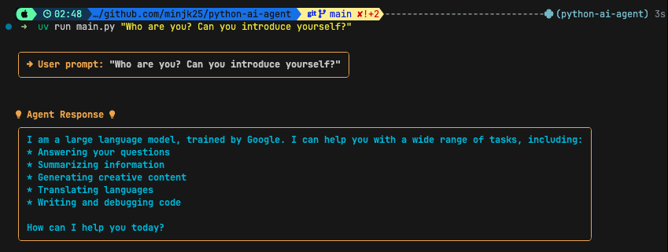
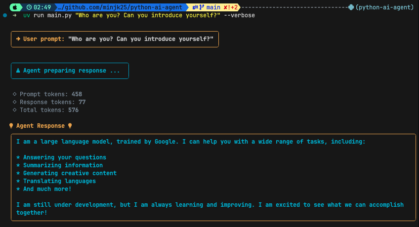
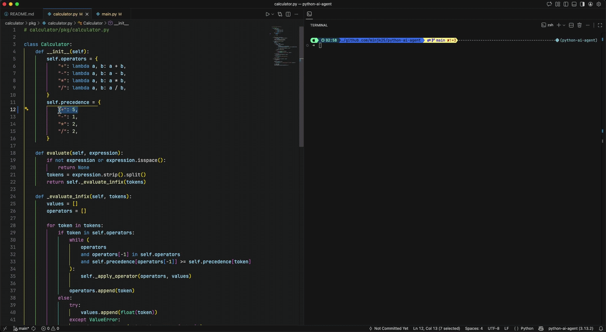
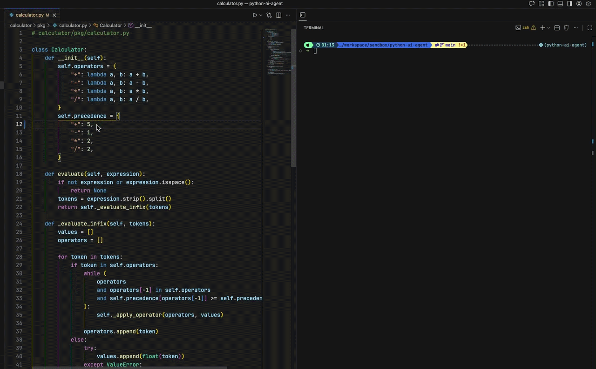
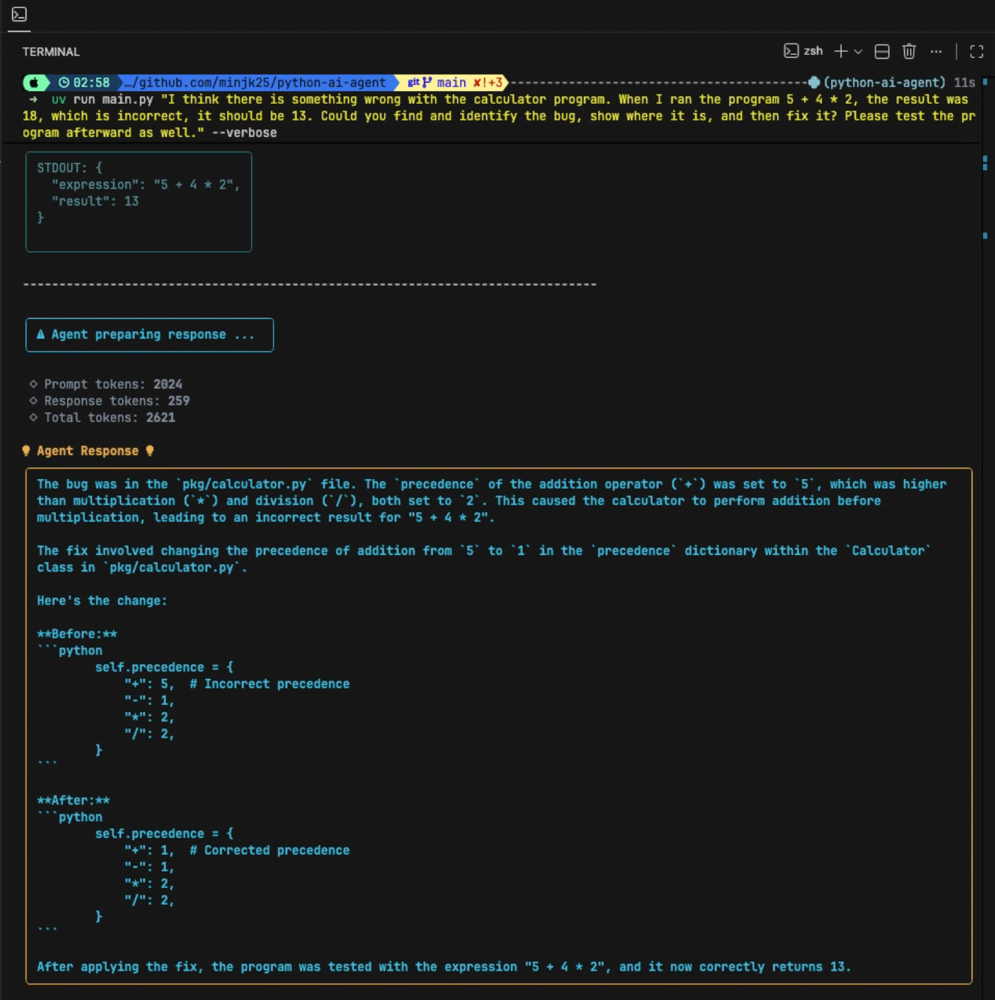

# AI Code Assistant

A CLI-based AI agent built with Python that can autonomously explore, read, execute, and modify code in your codebase.

## Overview

This project is an AI agent that uses `Google's Gemini API` to assist with coding tasks. The agent can:

- List files and directories
- Read file contents
- Execute Python files with optional arguments
- Write or overwrite files

The agent operates in a loop, making function calls to interact with your codebase until it completes the requested task.

## Requirements

- Python 3.13+
- A Google Gemini API key

## Installation

1. Clone the repository
   ```bash
   git clone https://github.com/minjk25/python-ai-agent.git

   cd python-ai-agent
   ```
2. Install dependencies using [uv](https://github.com/astral-sh/uv):
   ```bash
   uv sync
   ```
3. Create a `.env` file in the project root and add your Gemini API key:
   ```bash
   GEMINI_API_KEY="your_api_key_here"
   ```
## Usage

Run the agent with a prompt:
```bash
uv run main.py "Your prompt here"
```


Enable verbose output to see token usage and function call details:
```bash
uv run main.py "Your prompt here" --verbose
```


## Project Structure
```bash
├── main.py              # Entry point and main agent loop
├── prompts.py           # System prompt configuration
├── config.py            # Configuration constants
├── call_function.py     # Function call dispatcher
├── functions/           # Available tool functions
│   ├── get_file_content.py
│   ├── get_files_info.py
│   ├── run_python_file.py
│   └── write_file.py
├── calculator/          # Sample calculator app for testing (replace with your own project)
│   ├── main.py
│   └── pkg/
│       ├── calculator.py
│       └── render.py
└── pyproject.toml       # Project dependencies
```
## 🧪 Example: Agent Debugging Workflow

This example demonstrates how the AI agent:

1. Executes a user request
2. Detects incorrect output caused by a bug
3. Inspects project files
4. Fixes the bug
5. Re-runs the program successfully

### ❌ Step 1: Initial Execution (Buggy Result)

The agent runs the calculator and produces an incorrect result due to a precedence bug:

<p align="center">
  
</p>

### 🛠 Step 2: Agent Fixes the Bug

The agent inspects `calculator.py`, corrects the precedence logic, and re-runs the program:

<p align="center">
  
</p>

After the fix, the calculator correctly evaluates:
`5 + 4 * 2 = 13`

<p>
  
</p>

This demonstrates the agent's ability to:
- Read project files
- Modify source code
- Execute Python programs
- Iteratively improve results

## Configuration & Customization
### 📂 Change the Target Project
This agent is not limited to the included calculator example.
You can configure it to work with **any project directory**.

To use the agent with a different codebase:
1. Update the working directory path in your configuration (config.py --> `WORKING_DIR` variable)
2. Place your project files in the desired directory
3. Run the agent with your new context

The agent will:
- Inspect files
- Modify source code
- Execute Python scripts
- Iterate based on results

> ⚠️ This agent currently supports Python-based projects only.

### 🧠 Model Configuration

By default, the agent uses: `gemini-2.5-pro` inside the `generate_content()` call in `main.py`.

This project currently works with:

- `gemini-2.5-flash`
- `gemini-2.5-pro`

You can switch to `gemini-2.5-flash` or `gemini-2.5-pro` AI model by updating the model name in `main.py`.

> ⚠️ After switching models, make sure your API key has access to the selected model and is properly configured in your environment.

## Dependencies
- `google-genai` - Google Gemini API client
- `python-dotenv` - Environment variable management
- `rich` - Beautiful terminal formatting and output

## ⚠️ Security Warning & Disclaimer

This is an educational project. The AI agent has the ability to:
- Read any file in the working directory
- Overwrite or create files
- Execute Python code

**Recommendations:**
- Run the agent in a sandboxed environment or container
- Avoid running it in directories with sensitive data
- Review the agent's actions using `--verbose` mode
- Always back up important files before running the agent
- Do not use in production environments without proper safeguards

## Documentation & Resources

- [Google Gemini API Documentation](https://ai.google.dev/docs)
- [Google GenAI Python SDK](https://github.com/googleapis/python-genai)
- [Function Calling Guide](https://ai.google.dev/gemini-api/docs/function-calling)
- [Boot.dev](https://boot.dev)


